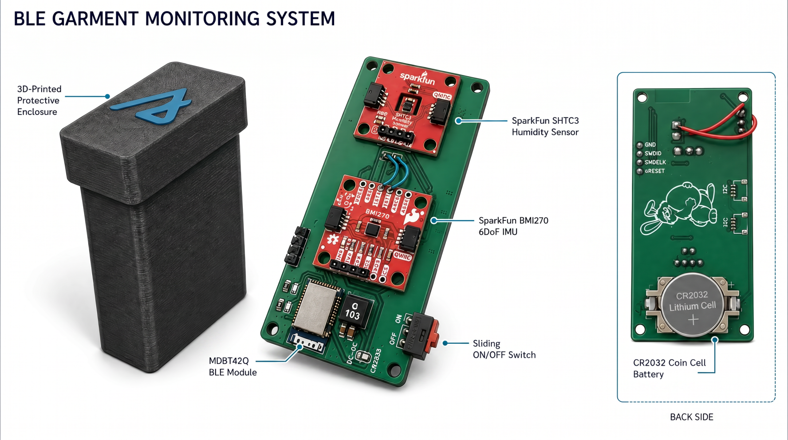

# BLE Garment Monitoring System

## Overview

This project presents an end-to-end system for monitoring garment usage using a custom Bluetooth Low Energy (BLE) tag, edge processing, and a mobile application.

The system tracks garment states such as **worn**, **stored**, and **washed** by analyzing sensor data broadcast from a custom BLE-enabled garment tag.

---
## Custom BLE Garment Tag

<p align="center">
  
</p>

<p align="center">
  Custom BLE garment tag with integrated motion (BMI270) and humidity (SHTC3) sensors, powered by a CR2032 coin cell.
</p>

---

## System Architecture

The system consists of four main components:

### 1. Hardware (`hardware/garment_tag/`)

* Custom PCB design (KiCad)
* BLE module (nRF52832 – Raytac MDBT42Q)
* Sensors:

  * BMI270 (motion / acceleration)
  * SHTC3 (humidity and temperature)
* Assembly and manufacturing files

---

### 2. Firmware (`firmware/garment_tag/`)

* Zephyr-based firmware for the BLE tag
* Reads sensor data and encodes it into BLE advertisement payloads
* Broadcasts data continuously

---

### 3. Edge Node (`edge/`)

* Runs on Raspberry Pi
* Scans BLE advertisements using Python and Bleak
* Processes data using filtering and aggregation
* Classifies garment states (worn / stored / washed)
* Stores data in SQLite database
* Exposes REST API (`/summary`) using Flask

---

### 4. Android Application (`android_app/garment_tracker_app/`)

* Built with Kotlin and Jetpack Compose
* Connects to edge node API
* Displays:

  * Current garment state
  * Wear count
  * Wash count
* Includes privacy controls and live updates

---

## Data Flow

1. Sensors on the BLE tag collect motion, humidity, and temperature
2. Firmware encodes data into BLE advertisements
3. Raspberry Pi scans and processes the data
4. Classification pipeline determines garment state
5. Results are stored locally and exposed via API
6. Android app fetches and displays usage summaries

---

## BLE Payload Structure

The edge node expects manufacturer-specific data in the following format:

* Byte 0 → motion (0 or 1)
* Byte 1 → humidity (%)
* Byte 2 → temperature offset (temp + 40)

Manufacturer ID: `1027`

---

## Getting Started

### 1. Hardware

* Assemble the custom BLE tag
* Flash firmware onto the nRF52832

### 2. Edge Node

```bash
cd edge
pip install -r requirements.txt
python pipeline_final.py
```

### 3. Android App

* Open `android_app/garment_tracker_app/` in Android Studio
* Update Raspberry Pi IP in the code
* Run the application

---

## Requirements

* Raspberry Pi with Bluetooth
* Custom BLE garment tag
* Android device
* Python 3.x

---

## Notes

* The system operates on a local network
* The Android app requires the Raspberry Pi API to be running
* BLE payload structure must match firmware and edge logic

---

## Documentation

Detailed documentation is available in:

* `docs/architecture.md` – system design and component overview  
* `docs/setup_guide.md` – installation and setup instructions  
* `docs/User_Manual.pdf` – how to use the system (end-user guide)

---

## Project Scope

This project focuses on:

* Edge-based processing (no cloud dependency)
* Privacy-preserving garment tracking
* Lightweight BLE-based sensing

---

## License

This project is developed for academic purposes.
